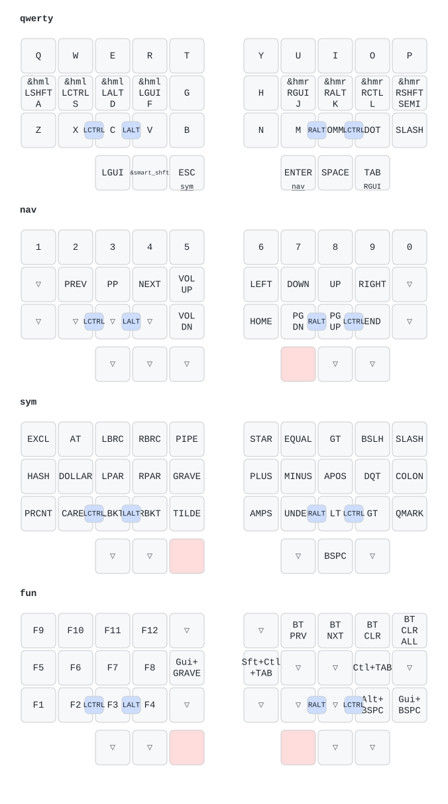

# limbatus

A 36-key wireless monoblock ergonomic keyboard derived from Dimetrodon.

## Current status
- Ships as a **36-key** layout (`thumb_keys_per_side: 3` in `ergogen/config.yaml`).
- Matrix is organized as a XIAO BLE-compatible logical `6 x 6` scan.
- `NFC1` is reserved for matrix use and must be configured as GPIO in firmware.
- The thumb cluster's anchor/shift/splay values match Dimetrodon's thumb
  cluster exactly (same fan shape, ported into limbatus's mirrored monoblock
  frame).

> The config also retains an optional **34-key** mode (`thumb_keys_per_side: 2`,
> which drops the third thumb key per side) as build infrastructure. The keyboard is
> designed, documented, and built as a 36-key; the 34-key path is kept working but
> not advertised.

## Latest PCB Images
- Top view: https://ccblaisdell.github.io/limbatus/limbatus-top.png
- Bottom view: https://ccblaisdell.github.io/limbatus/limbatus-bottom.png

## Build
1. Install dependencies:
   - `npm install`
2. Generate artifacts:
   - `make build`

For hand-assembly (soldering and case), see [`BUILD.md`](BUILD.md). Parts list is in [`BOM.md`](BOM.md).

## Firmware
Runs [ZMK](https://zmk.dev) as a single (non-split) XIAO BLE image. The config,
keymaps, pin map, and build/flash notes live in [`config/`](config/README.md);
CI builds the `limbatus_36` (36-key) and `limbatus` (34-key) shields and uploads
`.uf2` artifacts.

Default 36-key keymap (rendered by [keymap-drawer](https://github.com/caksoylar/keymap-drawer)):

## Verify Ergogen Changes
Run this whenever you change `ergogen/config.yaml`.

1. Confirm current thumb mode value:
   - `rg -n "thumb_keys_per_side" ergogen/config.yaml`
2. Build with current mode:
   - `make build`
3. Verify generated artifacts exist:
   - `ls outlines`
   - `ls pcbs`
4. Check what changed:
   - `git status --short`
5. Validate both key-count modes before merging layout changes:
   - 36-key mode: set `thumb_keys_per_side: 3` and set the reachy `skip` field to `false`, then run `make build`
   - 34-key mode: set `thumb_keys_per_side: 2` and set the reachy `skip` field to `true`, then run `make build`
6. In KiCad, open the generated board and confirm:
   - no missing footprints
   - expected key count (34 or 36)
   - MCU footprint placement still valid
   - no obvious overlap/regression in thumb cluster or center bridge

## Keyboard References
- https://github.com/ceoloide/corney-island for its GitHub Actions and workflows.
- https://github.com/ccblaisdell/dimetrodon for your previous keyboard iteration.

## Notes
- Target MCU is XIAO BLE nRF52840.
- Matrix pin map target: `P0..P5` for columns, `P6..P10` plus `NFC1` for rows.
- Includes a dedicated power switch footprint.
- No JST footprint; battery uses two direct-solder SMD pads (`local/battery_pads_solder`).
- No external reset switch footprint; rely on the onboard XIAO reset button.
- The current code-generated case approach is documented in `case/README.md` and is intended to use Ergogen DXFs plus an OpenSCAD/FreeCAD export flow.

## TODO
- Add 3d models for parts where possible
- Implement the code-generated case plan in `case/README.md`
- Design a second case with embedded apple magic trackpad
