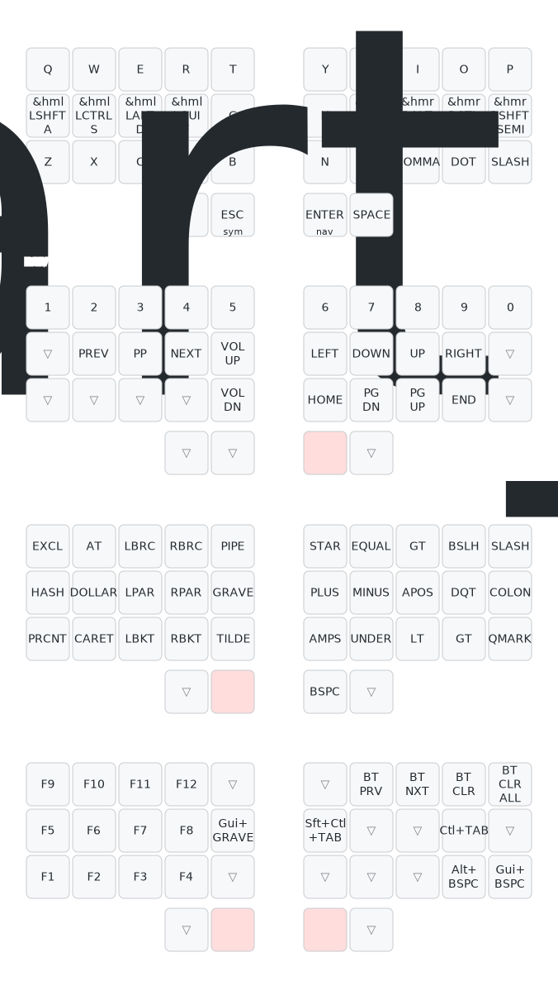
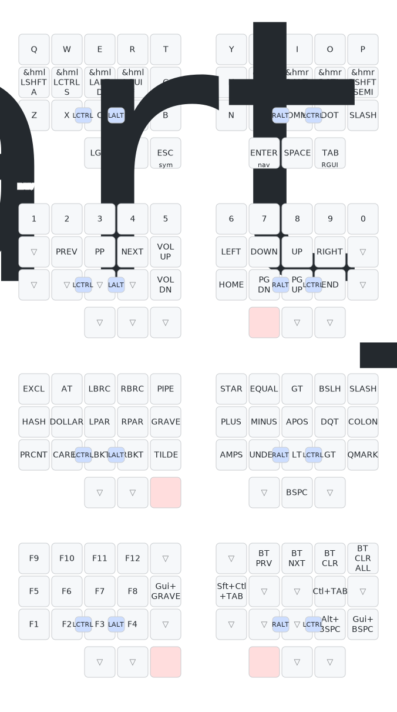

# limbatus ZMK firmware

ZMK config for **limbatus**, a monoblock (unibody, non-split) wireless keyboard
built on a single Seeed **XIAO BLE nRF52840** driving a logical **6×6 diode
matrix**. This is the shipping **34-key** layout.

Because limbatus is unibody, each build is one firmware image (one
`board + shield` pair) — not the `_left` / `_right` split pair you'd see on a
Dimetrodon-style board. Two shields share the same board and matrix:
`limbatus` (34-key, shipping default) and `limbatus_36` (36-key, retained).

## Layout

```
build.yaml                                   GitHub Actions build matrix (both shields)
config/
  west.yml                                   ZMK + urob/zmk-helpers, both pinned
  limbatus.keymap                            34-key keymap (QWERTY / NAV / SYM / FUN)
  limbatus_36.keymap                         36-key keymap (adds the 3rd thumb/side)
  limbatus.conf                              user Kconfig (battery, sleep, logging)
  boards/shields/limbatus/
    limbatus.dtsi                            shared kscan matrix (both shields)
    limbatus.overlay                         34-key transform + chosen
    limbatus_36.overlay                      36-key transform + chosen
    limbatus.conf / limbatus_36.conf         shield requirement (NFC pins as GPIO)
    limbatus.yml / limbatus_36.yml           shield metadata
    Kconfig.shield / Kconfig.defconfig       shield selection + names
keymap_drawer.config.yaml                    keymap-drawer styling
keymap-drawer/                               generated keymap SVGs (committed by CI)
.github/workflows/zmk-build.yml              firmware CI (pinned reusable workflow)
.github/workflows/draw-keymaps.yml           keymap image CI (keymap-drawer)
```

## Matrix ↔ pin mapping

The single source of truth for wiring is `ergogen/config.yaml`
(`pcbs.limbatus.footprints.xiao_ble`). This firmware mirrors it:

| Matrix | XIAO pin | ZMK reference | nRF pin |
| ------ | -------- | ------------- | ------- |
| C0 | D0  | `&xiao_d 0`  | P0.02 |
| C1 | D1  | `&xiao_d 1`  | P0.03 |
| C2 | D2  | `&xiao_d 2`  | P0.28 |
| C3 | D3  | `&xiao_d 3`  | P0.29 |
| C4 | D4  | `&xiao_d 4`  | P0.04 |
| C5 | D5  | `&xiao_d 5`  | P0.05 |
| R0 | D6  | `&xiao_d 6`  | P1.11 |
| R1 | D7  | `&xiao_d 7`  | P1.12 |
| R2 | D8  | `&xiao_d 8`  | P1.13 |
| R3 | D9  | `&xiao_d 9`  | P1.14 |
| R4 | D10 | `&xiao_d 10` | P1.15 |
| R5 | NFC1 | `&gpio0 9`  | P0.09 |

Diodes run switch→row with the anode on the column side, so
`diode-direction = "col2row"`: columns are strobed outputs, rows are sampled
inputs (pulled down).

**NFC pin:** R5 lives on P0.09, an NFC antenna pin by default.
`boards/shields/limbatus/limbatus.conf` sets `CONFIG_NFCT_PINS_AS_GPIOS=y` so
P0.09/P0.10 become plain GPIO. This is written into UICR on first flash; if the
sixth row is dead, confirm this landed. (Matches the CLAUDE.md decision: "disable
NFC and use NFC1 as GPIO for the sixth matrix row.")

## Building

CI (`.github/workflows/zmk-build.yml`) builds `xiao_ble//zmk` with both the
`limbatus` and `limbatus_36` shields on every push that touches `config/**` or
`build.yaml`, and uploads a `firmware` artifact containing `limbatus.uf2` /
`limbatus_36.uf2`. Flash the one you built by double-tapping reset (via the case
tab) to enter the UF2 bootloader and dropping the `.uf2` onto the mass-storage
volume.

The board target is `xiao_ble//zmk` — the `//zmk` selects ZMK's board variant
(the SoC is omitted since nRF52840 is the only one). Plain `xiao_ble` builds the
bare Zephyr board and CI rejects it as "Missing ZMK Compat".

Local build (34-key; use `-DSHIELD=limbatus_36` for the 36-key build):

```sh
west build -s zmk/app -b 'xiao_ble//zmk' -- -DSHIELD=limbatus -DZMK_CONFIG=$(pwd)/config
```

## Keymap images

`.github/workflows/draw-keymaps.yml` renders each keymap with
[keymap-drawer](https://github.com/caksoylar/keymap-drawer) on every keymap
change and commits the SVGs into `keymap-drawer/`. limbatus is an unknown board
to keymap-drawer, so the workflow draws it as a split 3×5 with 2 (or 3) thumbs
per side via `--ortho-layout`.

<!-- These render once the draw-keymaps workflow has run and committed the SVGs. -->
### 34-key (`limbatus`)


### 36-key (`limbatus_36`)


## Versions

ZMK and urob/zmk-helpers are pinned in `config/west.yml`; the reusable build
workflow in `.github/workflows/zmk-build.yml` is pinned to the **same** ZMK
commit. Bump them together. ZMK is currently tracking a `main` commit (there is
no release tag yet that ships the `xiao_ble` board id used here); if CI breaks
after a helper bump, re-pin to a known-good pair.

## 34-key vs 36-key

Both modes share `limbatus.dtsi` (the 6×6 kscan is identical); only the
matrix-transform and keymap differ. The 36-key build adds the third "reachy"
thumb per side at the otherwise-unused intersections **C5,R2** (left) and
**C5,R5** (right), so a 34-key board simply never scans them. Transform thumb
rows (verified against generated PCB geometry, outer→inner):

| | left thumbs | right thumbs |
| --- | --- | --- |
| 34-key | tucky `RC(0,5)`, middle `RC(1,5)` | middle `RC(4,5)`, tucky `RC(3,5)` |
| 36-key | tucky `RC(0,5)`, middle `RC(1,5)`, reachy `RC(2,5)` | reachy `RC(5,5)`, middle `RC(4,5)`, tucky `RC(3,5)` |

The 34-key `limbatus` is the advertised/shipping default; `limbatus_36` is kept
building so the option doesn't rot (mirrors the ergogen `thumb_keys_per_side`
toggle). Match the firmware you flash to the number of thumb switches you built.
